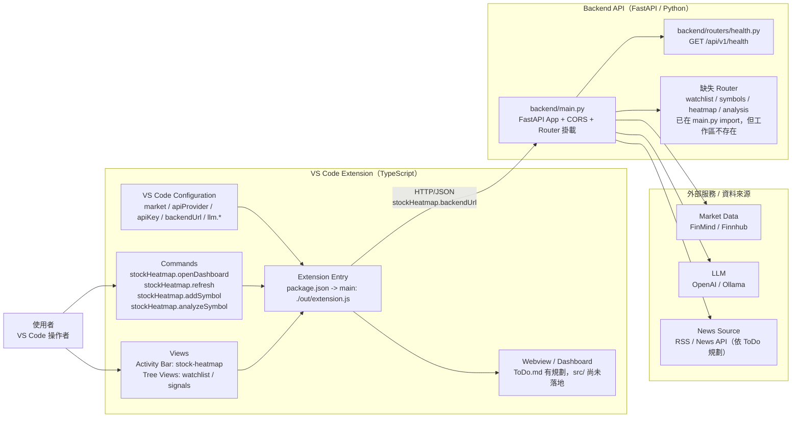
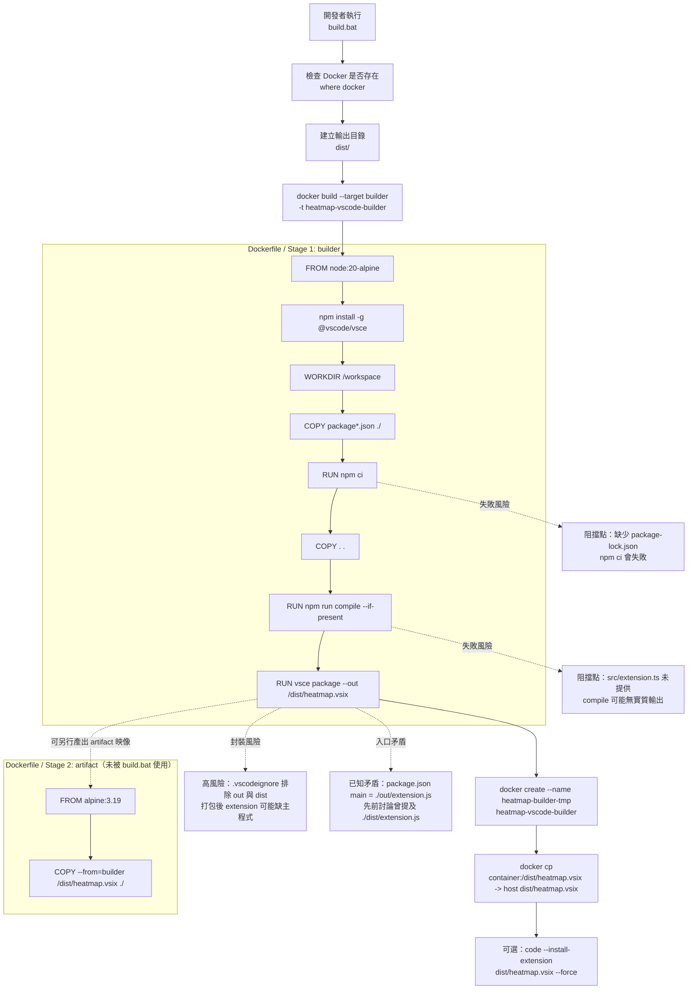

# Stock Heatmap 架構圖

> 產出者：工程師 #1  
> 範圍：D1 系統總覽圖、D3 建置流程圖  
> 依據檔案：
> - `backend/main.py`
> - `backend/routers/health.py`
> - `docker-compose.yml`
> - `Dockerfile`
> - `build.bat`

---

## D1 — 系統總覽圖

### D1 備註
- 系統主幹為：**使用者 → Extension → Backend → 外部服務**
- `backend/main.py` 已啟用 `CORSMiddleware`
- `health.py` 是目前唯一存在的 router 實作
- `watchlist`、`symbols`、`heatmap`、`analysis` 已在 `main.py` 匯入，但工作區缺檔
- Extension 入口目前為 `./out/extension.js`，但 `src/` 尚未落地

---

## D3 — 建置流程圖

### D3 備註
- `build.bat` 實際只使用 **Stage 1 builder**
- `.vsix` 是由 `builder` 產出後，透過 `docker create` + `docker cp` 複製到主機 `dist/`
- **Stage 2 artifact** 存在於 `Dockerfile`，但**不在 `build.bat` 主流程上**
- `docker-compose.yml` 的 `builder` 服務，本質上也是直接輸出 `.vsix`

---

## 已知風險摘要

1. `package-lock.json` 缺失  
   - `npm ci` 會失敗

2. `.vscodeignore` 排除 `out` 與 `dist`  
   - 打包後可能遺失主程式

3. `src/` 未落地  
   - `tsc` 可能無實質輸出

4. Backend router 不完整  
   - `main.py` 匯入的多數 router 缺失
